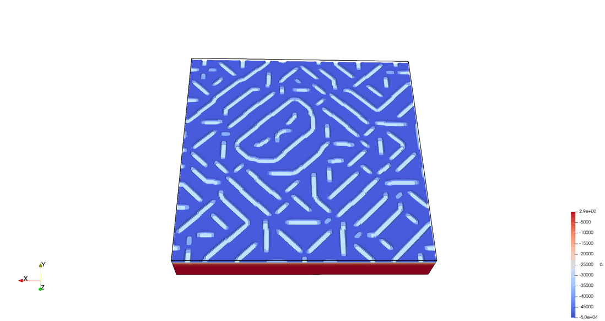

## About Me

Hi! I am a Postdoc fellow in Prof. [Laura De Lorenzis](https://scholar.google.com/citations?hl=en&user=qYnztGgAAAAJ)'s [Computational Mechanics Group](https://compmech.ethz.ch/) at ETH Zurich. I received my doctoral degree (Dr.-Ing) from the Institute of Applied Mechanics (Civil Engineering) at the University of Stuttgart in 2019, under the supervision of Prof. [Wolfgang Ehlers](https://scholar.google.com/citations?user=GrHhBGkAAAAJ&hl=en&oi=ao). I received my master's degree of science in computational mechanics of materials and structures ([COMMAS program](https://www.commas.uni-stuttgart.de/program/)) also from the Univeristy of Stuttgart. Before that, I received a bachelor degree of Engineering from Tongji University in Shagnhai, China.

## Research Interests
My research has been focusing on fracturing saturated and unsaturated porous media with applications to hydraulic fracturing and desiccation cracks.
* Phase-field modeling of hydraulic fracturing
* Phase-field modeling of desiccation cracks
* Numerical methods for phase-field models
* Bifurcation analysis of coupled systems

## Honors and awards
* 03.2019, summa cum laude, University of Stuttgart, Germany
* 04.2013, Honor Roll Student, University of Stuttgart, Germany
* 05.2012, Hilti Scholarship, Hilti AG, Liechtenstein
* 02.2012, DAAD fellowship, DAAD, Germany
* 07.2011, DAAD fellowship, DAAD, Germany

## Disertation
* Chenyi Luo (2019). A Phase-field Model Embedded in the Theory of Porous Media with Application to Hydraulic Fracturing. Dissertation, Report No. II-35, Institute of Applied Mechanics (CE), University of Stuttgart, 2019. ISBN 3-937399-35-5. ([download](http://elib.uni-stuttgart.de/bitstream/11682/10372/1/diss_chenyi_luo_online.pdf))

## Selected Publications

1. Ehlers, W., & Luo, C. (2017). [A phase-field approach embedded in the theory of porous media for the description of dynamic hydraulic fracturing](https://www.sciencedirect.com/science/article/pii/S0045782516305461). Computer Methods in Applied Mechanics and Engineering, 315, 348-368. ([pdf](http://www.wangyongliang.net/files/2017,%20phase-field%20approach,%20hydraulic%20fracturing.pdf))
2. Ehlers, W., & Luo, C. (2018). [A phase-field approach embedded in the Theory of Porous Media for the description of dynamic hydraulic fracturing, Part II: The crack-opening indicator](https://www.sciencedirect.com/science/article/pii/S0045782518303372). Computer Methods in Applied Mechanics and Engineering, 341, 429-442.
3. Luo, C., Chen, L., & Huang, Y. (2021). [A phase-field crack model based on a directional strain decomposition and a stress-driven Crack-Opening Indicator](https://doi.org/10.1016/j.cma.2021.113928). Computer Methods in Applied Mechanics and Engineering, 384, 113928.([pdf](https://www.researchgate.net/publication/352244130_A_phase-field_crack_model_based_on_a_directional_strain_decomposition_and_a_stress-driven_Crack-Opening_Indicator))
